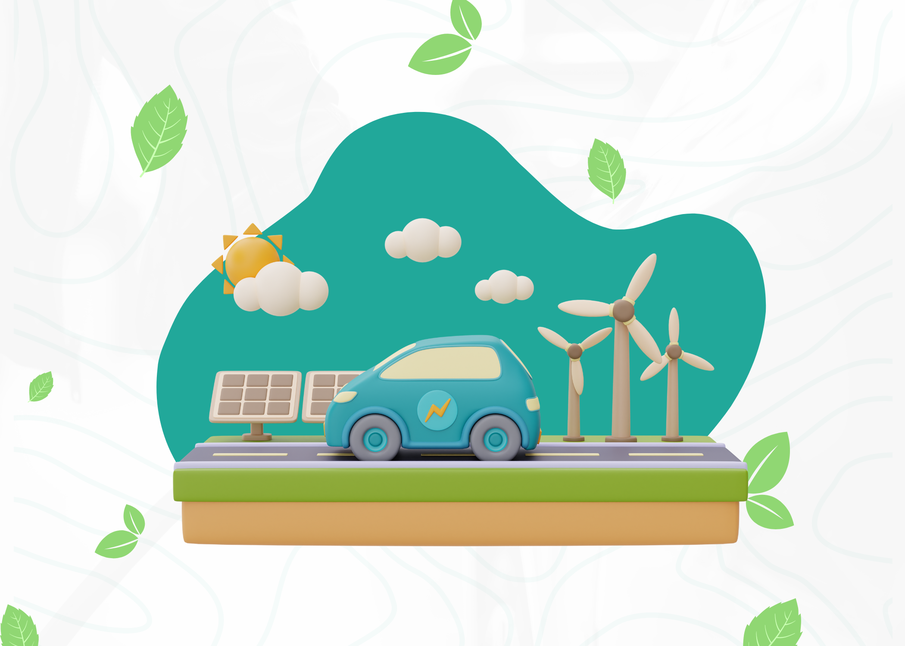
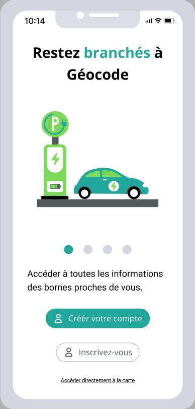
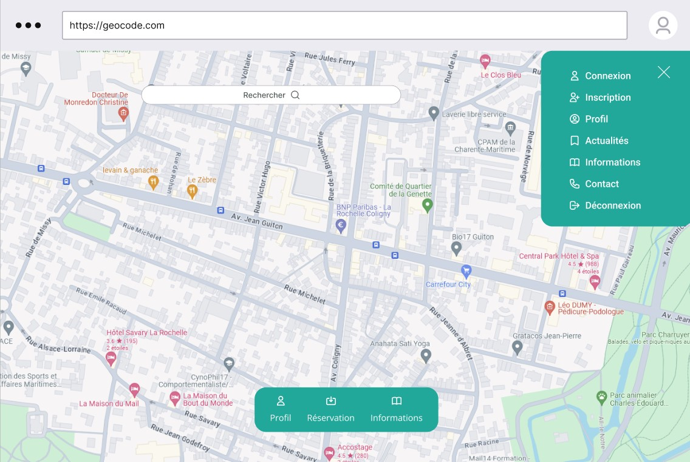
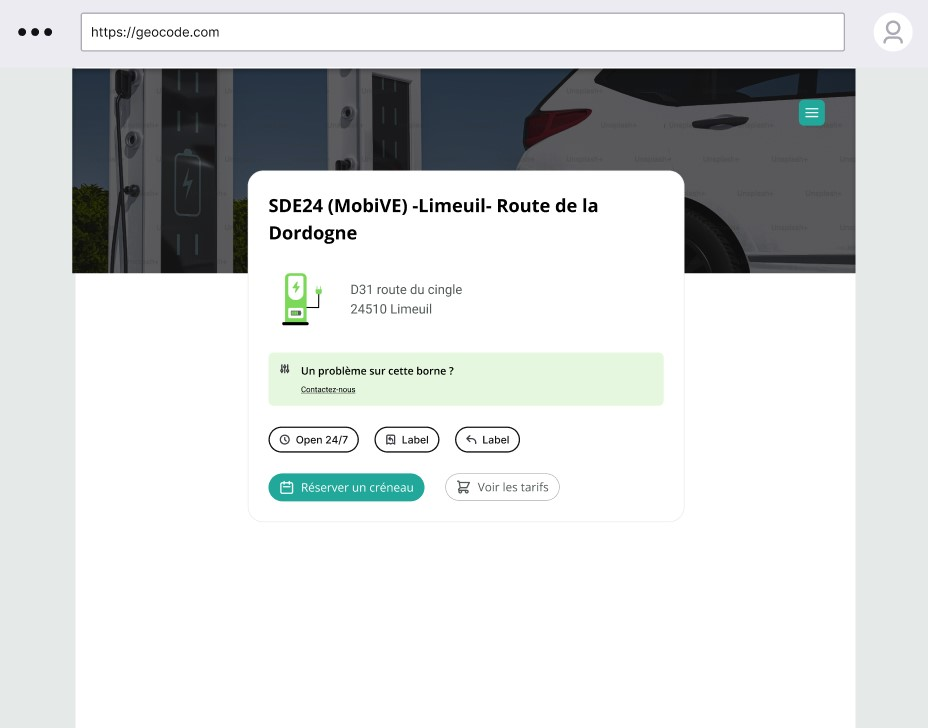

<h1 align="center"> 🚗 Bienvenue chez Geocode ! 🚗 </h1>
<p align="center">

</p>
<br>

# 📄 A propos :

Geocode est une l'application idéale pour la géolocalisation des bornes électriques. Trouvez rapidement et facilement des bornes de recharge proches de vous et planifiez vos trajets en toute sérénité. 

<p align="center"> ⚡Simplifiez votre expérience de conduite électrique avec Geocode ! ⚡</p>

# 👩🏽‍💻 Découvrez le site :
[Site de Geocode](https://geo-code.remote-fr-2.wilders.dev/)


# 🎨 Design (maquettes):

<div align="center">
<h2> Phone </h2>

</div>

<div align="center">
<h2> Desktop </h2>

<p></p>

</div>


# 💻 Stack Technique:


## 👨‍🔧 Installation

```sh
npm install
```
📁 Création du fichier d'environnement se basant sur les .env.sample (exemples) présents dans les fichiers client et server.  

🔚 Geocode met en place des endpoints pour faciliter l'interaction entre le client et le serveur via des opérations CRUD (Create, Read, Update, Delete). Voici les différents endpoints : 
-  /api/users : Pour la gestion des utilisateurs.
-  /api/cars : Pour la gestion des véhicules.
-  /api/brands : Pour la gestion des marques de véhicules.
-  /api/models : Pour la gestion des modèles de véhicules.
-  /api/terminals : Pour la gestion des bornes.
-  /api/roles : Pour la gestion des rôles.
-  /api/bookings : Pour la gestion des réservations.


# ©️ Crédits :

Geocode est un prototype de site web créé par une équipe de quatre étudiants de la Wild Code School :

- [Amandine Etchart](https://www.linkedin.com/in/dinetch/)
- [Fanny Prêtre](https://www.linkedin.com/in/fanny-pr%C3%AAtre/)
- [Vincent Pasquiou](https://www.linkedin.com/in/vincentpasquiou/)
- [Simon Bescheron](https://www.linkedin.com/in/simon-bescheron/)

Remerciements particuliers aux instructeurs et mentors ([Anthony Gorski](https://fr.linkedin.com/in/anthony-gorski) et [Samuel Faber](https://www.linkedin.com/in/samuelfaberdev/)) de la Wild Code School pour leurs conseils et leur soutien tout au long du processus de développement.
<br>
<br>
<br>
<br>
